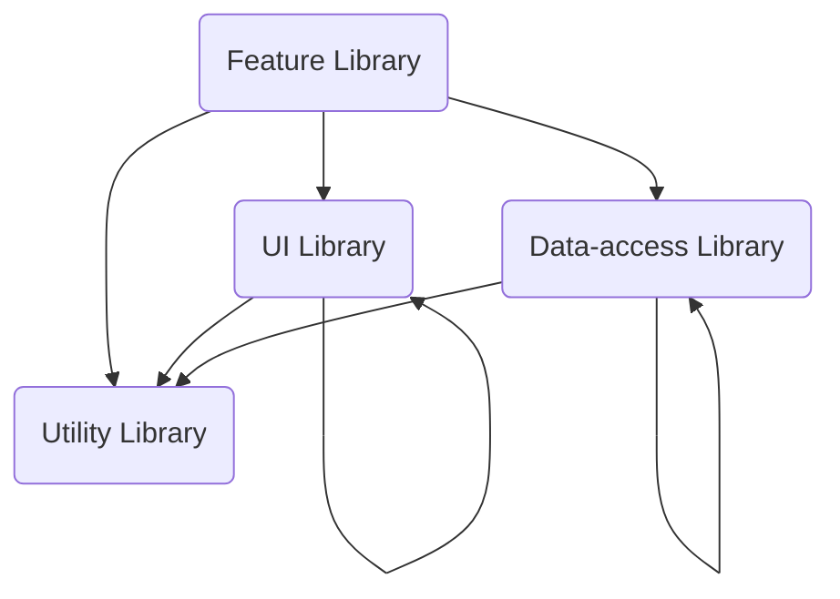

# NxMonorepoTutorial

<a alt="Nx logo" href="https://nx.dev" target="_blank" rel="noreferrer"></a>

✨ **This workspace has been generated by [Nx, a Smart, fast and extensible build system.](https://nx.dev)** ✨

## Development server

Run `nx serve store` for a dev server. Navigate to http://localhost:4200/. The app will automatically reload if you change any of the source files.

## Understand this workspace

Run `nx graph` to see a diagram of the dependencies of the projects.

## Remote caching

Run `npx nx connect-to-nx-cloud` to enable [remote caching](https://nx.app) and make CI faster.

# Table of Contents
- [Aplication and Libraries](#aplication-and-libraries)
- [Why Using Libraries](#why-using-libraries)
- [Library Types](#library-types)
- [Grouping Libraries](#grouping-libraries)
- [Development Workflow](#development-workflow)

# Aplication and Libraries

A typical Nx workspace is structured into "apps" and "libs". This distinction allows us to have a more modular architecture by following a separation of concerns methodology, incentivising the organization of our source code and logic into smaller, more focused and highly cohesive units.

- Apps configure dependency injection and wire up libraries. They should not contain any components, services, or business logic.
- Libs contain services, components, utilities, etc. They have well-defined public API.

A common mental model is to see the application as "containers" that link, bundle and compile functionality implemented in libraries for being deployed. As such, if we follow a 80/20 approach:

- 80% of your logic into the [libs/](/libs) folder
- 20% into [apps/](/apps)

> Developers new to Nx are initially often hesitant to move their logic into libraries, because they assume it implies that those libraries need to be general purpose and shareable across applications.

This is a common misconception, moving code into libraries can be done from a pure code organization perspective.

In fact when organizing libraries you should think about your business domains.

# Why Using Libraries

### 1. Faster Commands
The more granular your libraries are, the more effective nx affected and Nx's computation cache will be.

### 2. Visualizing Architecture
The nx graph command generates a graph of how apps and libraries depend on each other. If most of your code lives in a few giant libraries, this visualization doesn't provide much value.

### 3. Enforcing Constraints
You can enforce constraints on how different types of libraries depend on each other using tags.

# Library Types

<details>
<summary>Feature Libraries</summary>
<p>Contains a set of files that configure a business use case or a page in an application.Most of the components in such a library are smart components that interact with data sources.This type of library also contains most of the UI logic, form validation code, etc. Feature libraries are almost always app-specific and are often lazy-loaded.</p>

<p>
<strong>Naming Convention</strong><br>
feature (if nested) or feature-* (e.g., feature-home).
</p>

<p>
<strong>Dependency Constraints</strong><br>
A feature library can depend on any type of library.
</p>
</details>

<details>
<summary>UI Libraries</summary>
<p>
Collection of related presentational components. There are generally no services injected into these components (all of the data they need should come from Inputs).
</p>

<p>
<strong>Naming Convention</strong><br>
ui (if nested) or ui-* (e.g., ui-buttons, ui-containers, ui-form-components)
</p>

<p>
<strong>Dependency Constraints</strong><br>
A ui library can depend on ui and util libraries.
</p>
</details>

<details>
<summary>Data-Access Libraries</summary>
<p>
Contains code that function as client-side delegate layers to server tier APIs.
All files related to state management also reside in a data-access folder (by convention, they can be grouped under a +state folder under src/lib).
</p>

<p>
<strong>Naming Convention</strong><br>
data-access (if nested) or data-access-* (e.g. data-access-seatmap, data-backend-servicename)
</p>

<p>
<strong>Dependency Constraints</strong><br>
A data-access library can depend on data-access and util libraries.
</p>
</details>

<details>
<summary>Utility Libraries</summary>
<p>
Contains low level code used by many libraries. Often there is no framework-specific code and the library is simply a collection of utilities or pure functions.
</p>

<p>
<strong>Naming Convention</strong><br>
util (if nested), or util-* (e.g., util-format, util-validation, util-parsing)
</p>

<p>
<strong>Dependency Constraints</strong><br>
A utility library can depend only on utility libraries.
</p>
</details>

## Dependency Constraints Graph



# Grouping Libraries

Libraries should be grouped by scope. A library's scope is either application to which it belongs or (for larger applications) a section within that application.

> Don't be too anxious about choosing the exact right folder structure from the beginning. Libraries can be moved or renamed using the **@nrwl/workspace:move** generator.

## Example Workspace

The purpose of these folders is to help with organizing by scope. We recommend grouping libraries together which are (usually) updated together. It helps minimize the amount of time a developer spends navigating the folder tree to find the right file.

```shell
apps/                   <---- applications folder
  booking/              <---- booking application folder
  check-in/             <---- checkin application folder
  
libs/                   <---- libraries folder
  booking/              <---- grouping folder (booking app libraries)
    feature-shell/      <---- app-specific library

  check-in/             <---- grouping folder (check-in app libraries)
    feature-shell/      <---- app-specific library

  shared/               <---- grouping folder (common shared libraries)
    data-access/        <---- utility shared library

    seatmap/            <---- grouping by context folder
      data-access/      <---- shared library
      feature-seatmap/  <---- shared library
```

> Sharing Libraries
>
> One of the main advantages of using a monorepo is that there is more visibility into code that can be reused across many different applications. Shared libraries are a great way to save developers time and effort by reusing a solution to a common problem.

# Development Workflow

Embracing the monorepo-style development often requires some changes to the development workflow.

**Our CI should run the following checks:**

- It checks that the changed code is formatted properly. (nx format:check)
- It runs lint checks for all the projects affected by a PR/commit.
- It runs unit tests for all the projects affected by a PR/commit.
- It runs e2e tests for all the apps affected by a PR/commit.
- It rebuilds all the apps affected by a PR/commit.

> Note all the projects affected by a PR/commit. This is very important. Monorepo-style development only works if we rebuild, retest, and relint only the projects that can be affected by our changes. If we instead retest everything, we will get the the following problems:

- The performance of CI checks will degrade over time. The time it takes to run the CI checks should be proportional to the impact of the change, not the size of the repo.
- We will be affected by the code your change didn’t touch
- We should utilize affected:* commands to build and test projects. Read more about them [here](https://nx.dev/packages/nx/documents/affected).

# Official Reference Documentation
- [Mental Mode](https://nx.dev/concepts/mental-model)
- [Applications and libraries](https://nx.dev/more-concepts/applications-and-libraries)
- [Library Types](https://nx.dev/more-concepts/library-types)
- [Creating Libraries](https://nx.dev/more-concepts/creating-libraries)
- [Grouping Libraries](https://nx.dev/more-concepts/grouping-libraries)
- [Using Nx at Enterprises](https://nx.dev/packages/nx/documents/affected)
